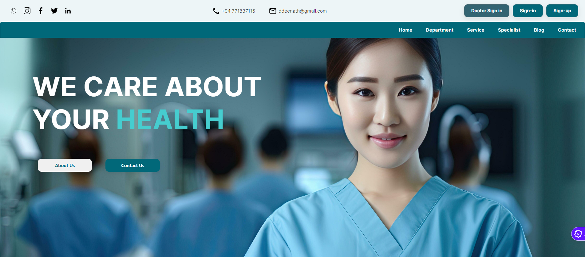

# CareBridge [Development on hold]

2nd year final project to build a web platform for Sri Lankan people who lives overseas to gain access to SL medical advice at low-cost or for completely free (DEMO ONLY)

```java
This app is protected by O.R.K.M.M License which is a 
self-made license which stands for ONA REDDAK KARAGANIN MATA MOKO 
(in English - Do whatever the fuck you want to do with this, 
I don't give a damn)
```

## Home Page



## Sign in Page


## Class Diagram


## Software Architecture

